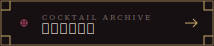
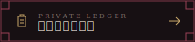

<div align="center">

<p><sub>AFTER MIDNIGHT · COCKTAIL ARCHIVE</sub></p>

# 𝑵𝒐𝒄𝒕𝒖𝒓𝒏𝒆

### 一份写给夜晚，并持续生长的调酒索引

<p>
  <a href="https://ying-iroha.github.io/Menu/Menu/"></a>
  &nbsp;
  <a href="https://ying-iroha.github.io/Menu/Menu/ledger.html"></a>
</p>

<p><sub>VANILLA JS FRONTEND &nbsp;·&nbsp; FASTAPI + SQLITE BACKEND</sub></p>

</div>

---

## About the night

Nocturne 是一份鸡尾酒酒单，也是一册属于深夜的私人饮用记录。前端仍然是没有构建步骤的原生 JavaScript，酒单数据、点单台账单和结账历史现在都保存在后端的数据库里 —— 运行和部署方式见本 README。

客人看到的是安静、可搜索的经典鸡尾酒档案；调酒师使用独立点单台记录酒款、数量、折扣、实收金额与每一次饮用。设计以黑莓酒红、旧金、纸张颗粒和装饰艺术线条为核心，希望它更像一本酒吧里的旧册页，而不只是一张网页。

## Two surfaces

| 客用酒单 | 私人点单台 |
| :--- | :--- |
| 中英文酒名与风味描述 | 快速搜索并加入当前账单 |
| 经典鸡尾酒 / 特调双层索引 | 数量增减与实时合计 |
| 六大基酒与「其他」筛选 | 原价至 5 折的心情折扣 |
| 点击展开配方 | 临时特调固定价记录 |
| 响应式手机排版 | 结账归档与饮用历史 |

> 私人点单台的账单和历史现在保存在后端数据库里，换设备、换浏览器都能看到同一份记录；正在编辑、还没结账的账单仍缓存在浏览器 `localStorage` 中，只是为了防止刷新页面时丢失。

## The menu

当前酒单收录经典配方，并为继续加入特调预留了独立分类。搜索会同时匹配英文名、中文名、基酒、风味、价格和配方材料。

价格以人民币显示，主力区间控制在 ¥100 以下；用料或工序更特殊的酒款保留更高档位。私人点单台另设 ¥128 的「临时特调」，用于记录酒单外点单。

## Local ledger

访问 [`Menu/ledger.html`](./Menu/ledger.html) 可打开独立点单界面。它不会在客用酒单中出现入口，适合由调酒师根据客人口述自行记录。

每次结账会保存：

- 日期与时间
- 酒款及数量
- 本次备注
- 原价、折扣与实收金额

数据保存在服务器的 SQLite 数据库里，是「个人使用界面」，目前没有登录验证（管理后台 `admin.html` 有，见下面「关于管理后台的安全性」这一节，点单台本身暂时没有）。

## Project anatomy

```text
BarMenu/
├── backend/             # FastAPI + SQLite 后端
└── Menu/
    ├── index.html          # 客用酒单，从 /api/cocktails 读取数据
    ├── style.css           # 客用酒单视觉
    ├── script.js           # 筛选、搜索、渲染逻辑（数据来自后端）
    ├── ledger.html         # 私人点单台
    ├── ledger.css          # 点单台视觉
    ├── ledger.js           # 点单、折扣、结账（数据来自后端）
    ├── admin.html          # 酒单管理后台
    ├── admin.css           # 管理后台视觉
    ├── admin.js            # 增删改酒款逻辑
    └── assets/
        └── nocturne-menu-qr.png
```

前端本身仍然不需要构建步骤，但现在依赖 `backend/` 提供的 API 才能正常工作——直接双击打开 `Menu/index.html` 不会显示任何酒款，需要先启动后端服务（见下方「本地运行」）。

## 本地运行

需要 Python 3.10 及以上版本。

```bash
cd BarMenu/backend
python -m venv .venv

# Windows
.venv\Scripts\activate

pip install -r requirements.txt
uvicorn main:app --reload
```

启动后打开：

- 客用酒单：http://127.0.0.1:8000/menu.html
- 私人点单台：http://127.0.0.1:8000/menu/ledger.html
- 管理后台：http://127.0.0.1:8000/menu/admin.html
- API 文档：http://127.0.0.1:8000/docs

第一次启动会自动创建 `backend/bar_menu.db`，并写入初始酒单数据。这个数据库文件是本地运行数据，已被 `.gitignore` 忽略，不会提交到 GitHub。

## Updating the collection

酒款、配方、价格、风味描述现在都通过 [`Menu/admin.html`](./Menu/admin.html) 管理后台增删改，保存后客用酒单和点单台会在下次加载时自动读到最新数据，不需要再手改 `script.js` 或 `ledger.js`。

如果更喜欢直接改数据库，也可以调用后端 API（见下方「API 一览」）。一款酒对应的字段是：英文名（唯一标识）、中文名、基酒、酒单分类（经典/特调）、价格、风味描述、配方（每行一种材料），以及可选的「点单台置顶顺序」。

## API 一览

| 方法 | 路径 | 用途 |
| :--- | :--- | :--- |
| GET | `/api/cocktails` | 全部酒款 |
| POST | `/api/cocktails` | 新增酒款 |
| PUT | `/api/cocktails/{id}` | 编辑酒款 |
| DELETE | `/api/cocktails/{id}` | 删除酒款 |
| GET | `/api/ledger/catalog` | 点单台快速点单目录 |
| GET | `/api/orders?limit=100` | 结账历史 |
| POST | `/api/orders` | 新建一条结账记录 |
| DELETE | `/api/orders/{id}` | 删除一条历史记录 |

## 关于管理后台的安全性

`/menu/admin.html` 和所有会改数据的接口（新增/编辑/删除酒款）现在有用户名+密码保护（HTTP Basic Auth）。浏览器第一次打开管理后台会弹出系统自带的登录框，输一次之后同一个浏览器会记住。客用酒单、点单台和结账接口不受影响，照常任何人都能访问。

默认账号密码是 `admin` / `nocturne`，**只是占位，务必自己改掉**，通过环境变量设置：

```bash
export ADMIN_USERNAME="你自己的用户名"
export ADMIN_PASSWORD="一个够长的密码"
```

用 `systemd` 常驻运行的话，在 service 的 drop-in 配置里加：

```ini
[Service]
Environment=ADMIN_USERNAME=你自己的用户名
Environment=ADMIN_PASSWORD=一个够长的密码
```

没设置这两个环境变量时会用默认值兜底，方便本地测试，但**不要就这么部署到公网上**——尤其这份代码是公开仓库，默认密码谁都看得到。这只是最基础的一层保护，生产环境建议一定要配 HTTPS，不然密码会在 HTTP 明文中被截获。

## Scan the archive

<div align="center">
  <a href="https://ying-iroha.github.io/Menu/Menu/">
    
  </a>
  <p><sub>扫码进入 Nocturne Cocktail Archive</sub></p>
</div>

---

<div align="center">
  <sub>Drink with intention · Record what mattered</sub>
</div>
